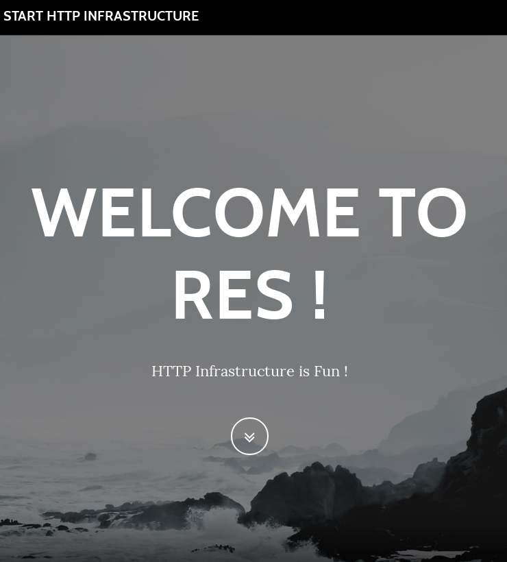
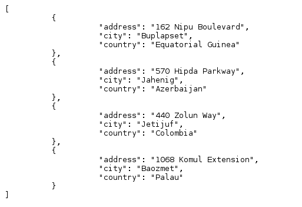
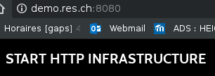
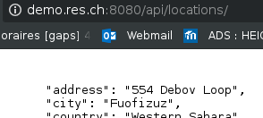
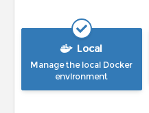
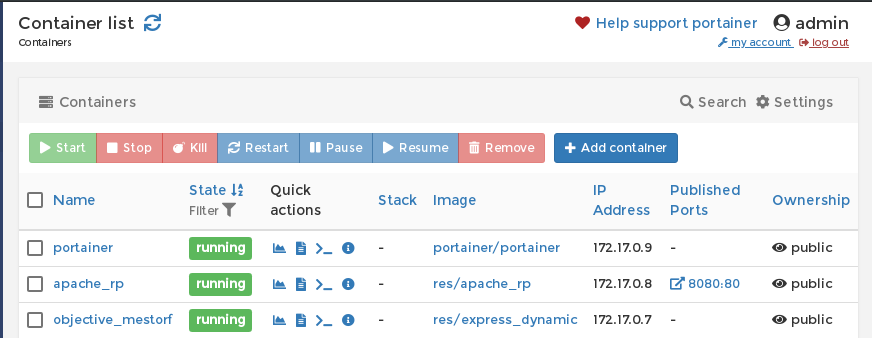

#Teaching-HEIGVD-RES-2018-Labo-HTTPInfra

*Ce laboratoire à été effectué exclusivement sur Linux.*

## Step 1: Static HTTP server with apache httpd

Dans cette étape, nous avons choisis un template Bootstrap gratuit disponible sur [https://startbootstrap.com/template-overviews/grayscale/](https://startbootstrap.com/template-overviews/grayscale/) et avons fait quelques modifications afin d'avoir un lien sur notre repo ainsi qu'une localisation de l'HEIG-VD en bas de page.

Lancement avec : `docker run -d -p 8080:80 res/apache_php`

Ouvrir avec browser avec comme URL :`DOCKER_IP:8080`



Nous avons chosis une version plus récente de l'image utilisé dans le webcast : `FROM php:7.0-apache `


## Step 2: Dynamic HTTP server with express.js

Pour ce qui est de fournir du contenu dynamique, nous avons retourner une liste d'adresses

* Lancement avec : `docker run -d -p 3000:80 res/express._dynamic`

* Ouvrir avec browser avec comme URL : `DOCKER_IP:3000`


## Step 3: Reverse proxy with apache (static configuration)

Nous commencons à configurer notre reverse proxy de maniere static, en harcodant les adresses -> Un peu dangereux car si les adresses changent alors ne marche plus ...

```
<VirtualHost *:80>
        ServerName demo.res.ch

        ErrorLog ${APACHE_LOG_DIR}/error.log
        CustomLog ${APACHE_LOG_DIR}/access.log combined

        ProxyPass "/api/locations/" "http://172.17.0.3:3000/"
        ProxyPassReverse "/api/locations/" "http://172.17.0.3:3000/"

        ProxyPass "/" "http://172.17.0.2:80/"
        ProxyPassReverse "/" "http://172.17.0.2:80/"

</VirtualHost>

```

* Lancement du serveur static : `docker run -d res/apache_php `

* Lancement du serveur dynamique : `docker run -d -p 3000:80 res/express_dynamic`

* Lancement du serveur du reverse proxy : `docker run -d -p 8080:80 res/apache_rp `






## Step 4: AJAX requests with JQuery

Ajout du script `<script src="js/locations.js"></script>` dans `index.html` 

```
$(function(){
	console.log("loading locations");
	function loadLocations(){
        $.getJSON("/api/locations/", function( locations){
                console.log(locations);
                var message = "Nobody is here";
                if(locations.length > 0){
                        message =locations[0].city + " "+locations[0].country;
                }
                $(".intro-text").text(message);
		});
	};
	loadLocations();
	setInterval(loadLocations,2000);
});

```

Affiche dynamiquement (toutes les 2 secondes) une ville (fake) et un pays (réel)

## Step 5: Dynamic reverse proxy configuration

Nous avons creer un template php afin de rendre la configuration dynamique -> beaucoup plus propre
```
<?php  
$static_app = getenv('STATIC_APP');
$dynamic_app=getenv('DYNAMIC_APP');

?>
<VirtualHost *:80>
        ServerName demo.res.ch

        ErrorLog ${APACHE_LOG_DIR}/error.log
        CustomLog ${APACHE_LOG_DIR}/access.log combined

        ProxyPass '/api/locations/' 'http://<?php print "$dynamic_app"?>/'
        ProxyPassReverse '/api/locations/' 'http://<?php print "$dynamic_app"?>/'

        ProxyPass '/' 'http://<?php print "$static_app"?>/'
        ProxyPassReverse '/' 'http://<?php print "$static_app"?>/'

</VirtualHost>

```

## Additional steps 

## Automatisation

Nous avons créer un script `demo.sh` à la racine du repo qui change de comportement selon la branche dans laquelle nous nous trouvons.

### Load balancing: multiple server nodes

Nous avons choisis de creer un pool de 3 serveurs par noeuds 

```

<?php  
$static_app1 = getenv('STATIC_APP1');
$dynamic_app1=getenv('DYNAMIC_APP1');

$static_app2 = getenv('STATIC_APP2');
$dynamic_app2=getenv('DYNAMIC_APP2');

$static_app3=getenv('STATIC_APP3');
$dynamic_app3=getenv('DYNAMIC_APP3');

?>
<VirtualHost *:80>
        ServerName demo.res.ch

        ErrorLog ${APACHE_LOG_DIR}/error.log
        CustomLog ${APACHE_LOG_DIR}/access.log combined

        <Proxy "balancer://dynamic">
                BalancerMember 'http://<?php print "$dynamic_app1"?>'
                BalancerMember 'http://<?php print "$dynamic_app2" ?>'
                BalancerMember 'http://<?php print "$dynamic_app3" ?>'

        </Proxy>

        <Proxy "balancer://static">
                BalancerMember 'http://<?php print "$static_app1"?>'
                BalancerMember 'http://<?php print "$static_app2" ?>'
                BalancerMember 'http://<?php print "$static_app3" ?>'

        </Proxy>

        ProxyPass '/api/locations/' 'balancer://dynamic/'
        ProxyPassReverse '/api/locations/' 'balancer://dynamic/'

        ProxyPass '/' 'balancer://static'
        ProxyPassReverse '/' 'balancer://static/'

</VirtualHost>


```


### Management UI

Utilisation de Portainer [https://portainer.io](https://portainer.io)

Deux commandes seulement sont necessaires :

`docker volume create portainer_data`

`docker run -d -v /var/run/docker.sock:/var/run/docker.sock -v portainer_data:/data portainer/portainer`

* Lancement de l'interface sur `DOCKER_IP:9000` :

* Necessite de creer un compte 

* Choisir `Manage Local Docker Environment`
	
* Il n'y a plus qu'à s'amuser avec ce très bel outil

	
